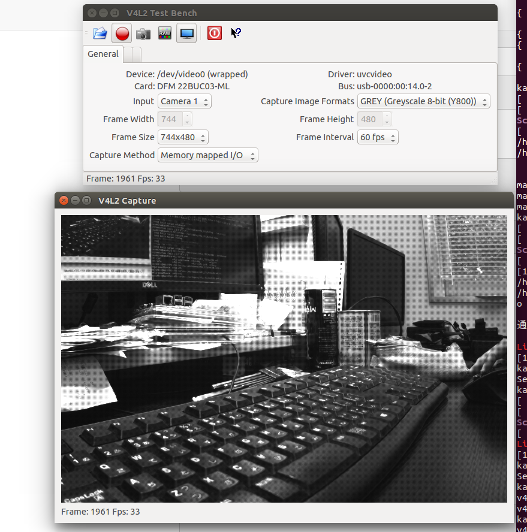

# v4l2を用いたプログラミング

## Prepare

1. v4l
```bash
sudo apt-get install -y libv4l-dev v4l-utils qv4l2
```
2. OpenCV
```bash
sudo apt-get update
sudo apt-get install libopencv-dev #2.4.9
```

## How to use

```bash
cd build
cmake ..
make

../v4ldevice
../listup [/dev/video*の番号]
../capture_one
```

## v4l device confirmation

```
qv4l2
```



## v4l,opencv,TIS camera

`v4ldevice`ではThe Imaging Souce社のカメラをv4lを用いてキャプチャする．
`main.cpp`の`/dev/video`の番号を適宜いじる必要あり．